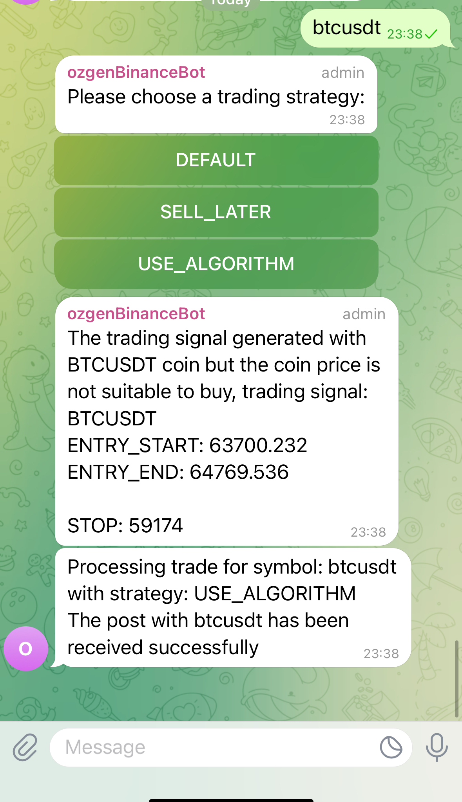

# Binance Java Bot

## Introduction

The Binance Java Bot is an automated trading bot designed to interact with the Binance cryptocurrency exchange and execute trades based on advanced technical analysis strategies. The bot utilizes key technical indicators such as the ZigZag pattern and Fibonacci retracement levels to determine optimal buy and sell points. This integration also includes a Telegram bot, allowing users to interact with the bot and receive trade signals directly via Telegram.

**NOT:** development still in progress ✔️

## Features
- Automatic trading execution using Binance API
- Detection of ZigZag patterns in market data
- Fibonacci retracement level calculation for buy and sell signals
- Telegram bot integration for receiving trading signals and selecting strategies
- Configurable investment and scheduling parameters
- Comprehensive test suite with coverage reporting

## ZigZag Patterns & Fibonacci Retracement Levels

### ZigZag Patterns
The ZigZag pattern is a technical analysis tool used to filter out market noise and highlight key trends in price movements. It identifies significant peaks (highs) and troughs (lows) by filtering out price changes below a specified percentage.

The ZigZag pattern is particularly useful for:
- Highlighting key market trends
- Reducing market noise
- Helping traders spot reversals and continuation patterns

The bot detects significant price movements using the ZigZag pattern and then applies Fibonacci retracement levels to determine optimal trading points.

### Fibonacci Retracement Levels
Fibonacci retracement levels are used to identify potential reversal points in an asset's price by calculating retracement levels based on the Fibonacci sequence (e.g., 23.6%, 38.2%, 50%, 61.8%, and 100%). These levels are crucial in determining where prices are likely to find support or resistance, which are important for making trading decisions.

The bot calculates the following Fibonacci retracement levels based on the highest and lowest ZigZag points:
- 23.6% (0.236)
- 38.2% (0.382)
- 50% (0.500)
- 61.8% (0.618)
- 76.4% (0.764)
- 100% (1.000)

These levels are used to determine entry points, take-profit targets, and stop-loss levels in the generated trading signals.

## Generated Trading Signal Format

The trading signals generated by the bot include the following components:
- **Symbol**: The cryptocurrency pair being traded (e.g., BTCUSDT).
- **Trending Status**: Whether the signal indicates a **BUY** or **SELL** trade.
- **Entry Start**: The lower boundary of the buy entry range, based on the 23.6% Fibonacci level.
- **Entry End**: The upper boundary of the buy entry range, based on the 38.2% Fibonacci level.
- **Take Profit Levels**: A series of levels (50%, 61.8%, 76.4%, etc.) indicating potential profit-taking points.
- **Stop Loss**: The stop-loss level based on the 100% Fibonacci retracement level, protecting against unfavorable market movements.
- **Close Price**: The current closing price of the asset.
- **High Price**: The highest price observed during the relevant period.
- **Low Price**: The lowest price observed during the relevant period.

### Example Trading Signal:
```
MDTBTC

TRENDING STATUS: BUY

ENTRY_START: 0.00000125
ENTRY_END: 0.00000150

TP1: 0.00000181
TP2: 0.00000195
TP3: 0.00000214
TP4: 0.00000245
TP5: 0.00000266
TP6: 0.00000300
TP7: 0.00000353
TP8: 0.00000400

STOP: 0.00000120
```
This format clearly defines the trending status (BUY or SELL), entry points, take-profit levels, and stop-loss level, allowing the trader to execute the trade efficiently.

## Getting Started

### Prerequisites
- Java 21
- Maven
- Binance account
- Telegram account

### Installation
1. Clone the repo: `git clone https://github.com/ozgen/binance-java-bot.git`
2. Navigate to the directory: `cd binance-java-bot`
3. Build with Maven: `mvn clean install`

### Configuration
Configure the application using environment variables or a `.env` file. Here are the key variables you need to set:

#### Sample `.env` File
```
DB_USER=user
DB_PASSWORD=password
DB_NAME=app
DB_HOST=localhost
DB_PORT=5432
BINANCE_API_SECRET=<secret>
BINANCE_API_KEY=<key>
TELEGRAM_TOKEN=<token>
TELEGRAM_USERNAME=<bot-name>
TELEGRAM_BOT_ENABLED=true
TRADING_BOT_ENABLED=true
```

#### Bot Investment Configuration
- `app.bot.investment.currency`: Investment currency (e.g., `BTC`)
- `app.bot.investment.amount`: Total investment amount
- `app.bot.investment.perAmount`: Amount per trade
- `app.bot.investment.currencyRate`: Currency rate for conversion (e.g., `BTCUSD`)
- `app.bot.investment.percentageInc`: Percentage increase for buying
- `app.bot.investment.profitPercentage`: Profit percentage target
- `app.bot.investment.zigzagPercentage`: The percentage movement required to trigger ZigZag pattern detection (e.g., `0.01` for 1%)

#### Bot Schedule Configuration
- `app.bot.schedule.buyError`: Schedule interval for buy error in ms
- `app.bot.schedule.sellError`: Schedule interval for sell error in ms
- `app.bot.schedule.insufficient`: Schedule interval for insufficient balance in ms
- `app.bot.schedule.notInRange`: Schedule interval for not in range status in ms
- `app.bot.schedule.tradingSignal`: Schedule interval for trading signals in ms
- `app.bot.schedule.openSellOrder`: Schedule interval for open sell orders in ms
- `app.bot.schedule.openBuyOrder`: Schedule interval for open buy orders in ms
- `app.bot.schedule.monthBefore`: Number of months before for date calculations

#### Telegram Error Reporting Configuration
- `bot.telegram.enabled`: Set to `true` to enable the Telegram bot.
- `bot.trading.enabled`: Set to `true` to enable trading bot in Binance.

### Running the Bot
Start the bot with:
```bash
java -jar target/binance-telegram-bot-0.0.1-SNAPSHOT.jar
```

## Setup Instructions

### Telegram Bot Setup
1. **Create a Telegram Bot**: Follow the instructions on [Telegram's official documentation](https://core.telegram.org/bots#creating-a-new-bot) to create a new bot.
2. **Generate a Bot Token**: Use this [guide](https://medium.com/geekculture/generate-telegram-token-for-bot-api-d26faf9bf064) to generate a token for your Telegram bot.

---

## Example of the Bot in Action

Here's an example of how the bot works when a user enters a symbol and selects a trading strategy:



1. The user enters a trading pair (e.g., `btcusdt`).
2. The bot asks the user to choose a trading strategy.
3. After selecting a strategy, the bot processes the signal and provides a response with the trading signal details.

---

## Test Coverage

### Running Tests
Execute the test suite using Maven:
```bash
mvn test
```

### Coverage Reporting
After running the tests, generate a coverage report using JaCoCo (Java Code Coverage Library):
```bash
mvn jacoco:report
```
The coverage report can be found in `target/site/jacoco/index.html`. Open it in a web browser to view detailed coverage statistics.

## License
This project is licensed under the MIT License - see [LICENSE.md](LICENSE.md) for details.

## Acknowledgments
- Binance API
- Telegram API

---
